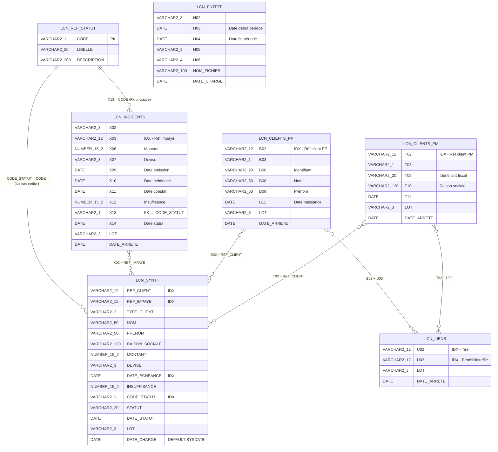

# PROJECT_AUDIT.md — Plateforme LCN ETL CFG Bank
> Généré le : 2026-04-13 | Auditeur : Antigravity AI  
> Stack : Spring Boot 4.0.5 · Oracle XE 21c (Docker) · Pentaho PDI · Java 17

---

## A. Résumé Exécutif

**Avancement estimé : 37 %**

Le projet possède des fondations structurellement saines : le schéma Oracle est solide, l'ETL Pentaho est complet et opérationnel, et l'infrastructure Docker fonctionne. Cependant, le backend Spring Boot est **quasi inexistant** — il n'y a qu'un `main()` vide et zéro ligne de code métier. Aucune entité JPA, aucun repository, aucun service, aucun controller REST n'ont été créés. Ce qui fonctionne aujourd'hui : le pipeline ETL (données → Oracle). Ce qui bloque toute utilisation réelle : l'absence totale du backend. Le projet ne peut pas exposer une seule donnée à un client.

**Prochaine action prioritaire** : implémenter les entités JPA + repositories + un premier endpoint GET `/api/synth` sur `LCN_SYNTH` (la table de synthèse qui est déjà la vue consolidée de toutes les données).

---

## B. Ce qui est présent et fonctionnel ✅

### Schéma Oracle
- ✅ 7 tables créées : `LCN_ENTETE`, `LCN_CLIENTS_PP`, `LCN_CLIENTS_PM`, `LCN_INCIDENTS`, `LCN_LIENS`, `LCN_REF_STATUT`, `LCN_SYNTH`
- ✅ Clé primaire sur `LCN_REF_STATUT(CODE)` avec contrainte nommée `pk_ref_statut`
- ✅ Clé étrangère `LCN_INCIDENTS.X13 → LCN_REF_STATUT.CODE` (contrainte `fk_incidents_statut`)
- ✅ 10 index sur les colonnes de jointure critiques (B02, T02, X03, X13, U02, U03, REF_CLIENT, REF_IMPAYE, CODE_STATUT, DATE_ECHEANCE)
- ✅ Données de référence insérées dans `LCN_REF_STATUT` (3 statuts : Impayé / Régularisé / Annulé)
- ✅ `LCN_SYNTH` : vue dénormalisée enrichie, colonne `DATE_CHARGE DEFAULT SYSDATE` présente

### ETL Pentaho
- ✅ 1 Job principal : `JOB_LCN_ETL_PRINCIPAL.kjb` — orchestre les 7 transformations en séquence
- ✅ 7 transformations .ktr couvrant toutes les tables cibles (TRF_00 à TRF_06)
- ✅ Flux de contrôle robuste : vérification d'existence du fichier, logs succès/erreur, ABORT en cas d'échec
- ✅ Paramétrage complet : `FICHIER_ENTREE`, `NOM_FICHIER`, `LOT_VAL`, `DATE_ARRETE_VAL`, `CHEMIN_TRANSFORMATIONS`
- ✅ TRF_01 : extraction positionnelle segment H → `LCN_ENTETE` (Insert/Update sur NOM_FICHIER) avec conversion dates yyyyMMdd
- ✅ TRF_00 : détection de doublons (`TRF_00_CHECK_DOUBLON.ktr`)
- ✅ Fichier de données réel présent : `data/CIL_DFF_001_050_20260305_001` (format positionnel DFF BAM avec segments H, X, U, T, B, F)
- ✅ Connexion Oracle dans les .ktr : JDBC `jdbc:oracle:thin:@//localhost:1521/xepdb1`, user `lcn_user`

### Docker Compose
- ✅ Service Oracle XE 21c (`gvenzl/oracle-xe:21-slim-faststart`) bien configuré
- ✅ Volume persistant `oracle_data` déclaré
- ✅ Healthcheck Oracle configuré (30s interval, 10 retries, 120s start_period)
- ✅ Fichier `.env` présent avec variables externalisées : `ORACLE_PORT`, `ORACLE_ADMIN_PASSWORD`, `ORACLE_USER`, `ORACLE_PASSWORD`, `ORACLE_SERVICE`

### Spring Boot — Configuration
- ✅ `application.properties` présent avec datasource Oracle correctement configurée
- ✅ `spring.jpa.hibernate.ddl-auto=none` (correct : le schéma est géré par SQL externe)
- ✅ `spring.jpa.show-sql=true` (utile en développement)
- ✅ Dialecte Hibernate Oracle configuré (`OracleDialect`)
- ✅ Port applicatif défini : `8089`

---

## C. Ce qui est absent ou vide ❌

### Backend Spring Boot — TOUT manque

| Composant | Status |
|-----------|--------|
| Entités JPA (`@Entity`) | ❌ Zéro — aucune classe Java pour LCN_SYNTH, LCN_INCIDENTS, etc. |
| Repositories (`JpaRepository`) | ❌ Zéro |
| Services métier (`@Service`) | ❌ Zéro |
| Controllers REST (`@RestController`) | ❌ Zéro endpoint |
| DTOs / Mappers | ❌ Zéro |
| Configuration CORS | ❌ Absente |
| Gestion des exceptions (`@ControllerAdvice`) | ❌ Absente |
| Pagination des résultats | ❌ Absente |
| Validation des entrées (`@Valid`) | ❌ Absente |
| Spring Security / authentification | ❌ Absente |
| Logging applicatif (Logback/log4j2) | ❌ Non configuré |
| Variables d'env externalisées | ❌ Credentials hardcodés dans `application.properties` |

**Il n'existe que 2 fichiers Java** :
- `LcnApiApplication.java` — le `main()` généré par Spring Initializr
- `LcnApiApplicationTests.java` — le test de contexte vide généré automatiquement

### Dépendances Maven manquantes

- ❌ `spring-boot-starter-data-jpa` absent en scope runtime (seul le pendant `test` est présent — erreur probable)
- ❌ `spring-boot-starter-validation` absent (Bean Validation)
- ❌ Aucune dépendance de mapping (MapStruct ou équivalent)
- ❌ Aucune dépendance de monitoring (`spring-boot-starter-actuator`)

### Infrastructure

- ❌ Le backend Spring Boot n'est pas conteneurisé dans le `docker-compose.yml`
- ❌ `pentaho/lib/` est vide — le driver JDBC Oracle (`ojdbc11.jar`) doit y être placé manuellement
- ❌ Init SQL non automatisé au démarrage du conteneur Oracle

### Documentation

- ❌ `README.md` complètement vide (0 octets)
- ❌ Aucune documentation d'API (Swagger/OpenAPI absent)
- ❌ Aucune procédure d'installation documentée

### Tests

- ❌ Aucun test unitaire ou d'intégration réel — uniquement le squelette `contextLoads()`

---

## D. Ce qui est incohérent ou risqué ⚠️

### Incohérences Maven critiques

> **`spring-boot-starter-webmvc` vs `spring-boot-starter-web`** : le starter officiel s'appelle `spring-boot-starter-web`. `spring-boot-starter-webmvc` est non-standard — vérifier s'il existe dans la version 4.0.5 du BOM.

> **`spring-boot-starter-data-jpa` absent** : La dépendance JPA de production est manquante. Seul `spring-boot-starter-data-jpa-test` (scope test) est déclaré. L'application plantera dès qu'on tentera d'injecter un Repository.

> **Spring Boot 4.0.5** : Cette version n'existe pas dans Maven Central au moment de l'audit (dernière stable : 3.x). Le build Maven risque d'échouer avec `Could not resolve dependencies`. Vérifier avec `mvn dependency:resolve`.

### Incohérences Schéma Oracle

| Problème | Détail |
|----------|--------|
| `LCN_SYNTH` créée sans préfixe de schéma | `CREATE TABLE LCN_SYNTH` (ligne 147) vs `CREATE TABLE lcn_user.LCN_SYNTH` pour toutes les autres tables — risque de créer la table dans le mauvais schéma |
| Aucune PK sur 6 tables sur 7 | `LCN_ENTETE`, `LCN_CLIENTS_PP`, `LCN_CLIENTS_PM`, `LCN_INCIDENTS`, `LCN_LIENS`, `LCN_SYNTH` — impossible pour JPA de définir un `@Id` simple |
| Noms de colonnes opaques (H02, X06, B11...) | Sans dictionnaire de données, le mapping Java sera illisible et source d'erreurs |

### Incohérences ETL ↔ Schéma

| Point | Détail |
|-------|--------|
| TRF_01 Insert/Update sur `NOM_FICHIER` | Mais `NOM_FICHIER` n'est pas une PK — l'idempotence repose sur un pseudo-unique non contraint |
| Chemins absolus hardcodés dans le .kjb | `C:\Users\hp\PycharmProjects\...` — le job ne fonctionnera sur aucune autre machine sans édition manuelle |

### Risques de sécurité

> **CAUTION — Credentials en clair** : `spring.datasource.password=lcn_pass_2026` est commité en clair dans `application.properties`. À remplacer par `${DB_PASSWORD}`.

> **CAUTION — `.env` commité dans Git** : contient `ORACLE_ADMIN_PASSWORD=LCN_Admin_2026`. Vérifier le `.gitignore`.

- Aucune authentification API planifiée (Spring Security absent)
- CORS non configuré — comportement imprévisible
- `spring.jpa.show-sql=true` doit être désactivé en production

---

## E. Ce qui est inutile ou à supprimer 🗑

| Élément | Raison |
|---------|--------|
| `spring-boot-starter-webmvc-test` (pom.xml) | Redondant/non-standard — inclus dans `spring-boot-starter-test` |
| `spring-boot-starter-data-jpa-test` seul (pom.xml) | Inutile sans la dépendance runtime JPA correspondante |
| `.venv/` à la racine | Environnement virtuel Python potentiellement commité — à exclure |
| `requirements.txt` Python | Python non documenté dans la stack — clarifier l'usage |
| `HELP.md` Maven | Généré par Initializr, sans valeur documentaire projet |
| Métadonnées vides dans `pom.xml` | `<name/>`, `<description/>`, `<url/>` vides — à remplir ou supprimer |
| `target/` Maven | Ne devrait pas être dans Git — vérifier le `.gitignore` |

---

## F. Roadmap Priorisée

### 🔴 CRITIQUE — Bloquerait la mise en production

1. **Corriger `pom.xml`** : remplacer les artefacts non-standards, ajouter `spring-boot-starter-data-jpa` en scope runtime, vérifier la version 4.0.5 (ou rétrograder à 3.3.x LTS)
2. **Créer les entités JPA** : `LcnSynth`, `LcnRefStatut`, `LcnIncident` — résoudre le problème de PK manquante (ajouter `ID GENERATED ALWAYS AS IDENTITY` ou composer des `@EmbeddedId`)
3. **Créer les Repositories** via `JpaRepository`
4. **Créer Services + Controllers REST** : endpoint minimal `GET /api/synth` paginé, `GET /api/synth/{refClient}`
5. **Externaliser les credentials** : passer en variables d'environnement `${ORACLE_URL}`, `${ORACLE_USER}`, `${ORACLE_PASSWORD}`
6. **Copier le driver JDBC** dans `pentaho/lib/` et documenter cette étape obligatoire
7. **Automatiser l'init SQL** dans le conteneur Oracle (`/docker-entrypoint-initdb.d/`)

### 🟡 IMPORTANT — Nécessaire pour un projet professionnel

8. **Ajouter des PKs au schéma Oracle** : colonne technique `ID NUMBER GENERATED ALWAYS AS IDENTITY PRIMARY KEY`
9. **Configurer CORS** : origines contrôlées via `WebMvcConfigurer`
10. **Ajouter Spring Security** : JWT ou Basic Auth
11. **Dépathifier les .kjb** : remplacer les chemins absolus Windows par des variables portables
12. **Ajouter Swagger/OpenAPI** (`springdoc-openapi`)
13. **Containeriser le backend** dans `docker-compose.yml`
14. **Écrire `README.md`** : prérequis, démarrage Docker, exécution ETL, démarrage API

### 🟢 OPTIONNEL — Améliorations futures

15. Profils Spring (`dev` / `prod`)
16. `spring-boot-starter-actuator` pour monitoring
17. MapStruct pour Entity ↔ DTO
18. Tests d'intégration avec TestContainers Oracle
19. Flyway ou Liquibase pour versionner les migrations
20. Table `LCN_LOG_ETL` pour tracer chaque exécution (lot, statut, nb lignes, durée)
21. Planification ETL via cron ou Spring Scheduler

---

## ERD — Diagramme Entité-Relation

---

## Cartographie ETL — Transformations Pentaho

| Transformation | Segment source | Table Oracle cible | Méthode | Paramètres |
|---|---|---|---|---|
| TRF_00_CHECK_DOUBLON | Fichier entier | — (contrôle) | Vérification | FICHIER_ENTREE |
| TRF_01_ENTETE | Lignes `H%` | LCN_ENTETE | Insert/Update (clé: NOM_FICHIER) | FICHIER_ENTREE, NOM_FICHIER |
| TRF_02_CLIENTS_PP | Lignes `B%` | LCN_CLIENTS_PP | Insert | FICHIER_ENTREE, LOT_VAL, DATE_ARRETE_VAL |
| TRF_03_CLIENTS_PM | Lignes `T%` | LCN_CLIENTS_PM | Insert | FICHIER_ENTREE, LOT_VAL, DATE_ARRETE_VAL |
| TRF_04_INCIDENTS | Lignes `X%` | LCN_INCIDENTS | Insert | FICHIER_ENTREE, LOT_VAL, DATE_ARRETE_VAL |
| TRF_05_LIENS | Lignes `U%` | LCN_LIENS | Insert | FICHIER_ENTREE, LOT_VAL, DATE_ARRETE_VAL |
| TRF_06_SYNTH | Jointure Oracle | LCN_SYNTH | TRUNCATE + rebuild | DATE_ARRETE_VAL, LOT_VAL |

**Flux orchestration** :  
`START → VERIFIER_FICHIER_EXISTE → TRF_01 → TRF_02 → TRF_03 → TRF_04 → TRF_05 → TRF_06 → LOG_SUCCES → FIN_SUCCES`  
En cas d'erreur : `→ LOG_ERREUR → FIN_ECHEC (ABORT)`

---

## Analyse Docker Compose — Cohérence

| Paramètre | docker-compose.yml | application.properties | Pentaho .ktr | Cohérent ? |
|---|---|---|---|---|
| Host Oracle | localhost | localhost | localhost | ✅ |
| Port Oracle | `${ORACLE_PORT}:1521` → 1521 | 1521 | 1521 | ✅ |
| Service (PDB) | — | xepdb1 | xepdb1 | ✅ (XE crée xepdb1 par défaut) |
| Utilisateur | `.env` lcn_user | lcn_user | lcn_user (encrypted) | ✅ |
| Mot de passe | `.env` lcn_pass_2026 | lcn_pass_2026 (⚠️ hardcodé) | Encrypted | ⚠️ Partiel |
| Init SQL | Non automatisé ❌ | — | — | ❌ Manuel requis |

---

## G. Score de Maturité du Projet

| Dimension | Score | Justification |
|---|---|---|
| **Schéma de données** | 3.5 / 5 | Bien structuré, FK et index, données ref. Manque PKs sur 6 tables, noms colonnes opaques, LCN_SYNTH sans préfixe schéma. |
| **Pipeline ETL** | 4 / 5 | Complet, paramétré, orchestré avec gestion d'erreurs. Manque chemins relatifs, gestion des rejets, driver JDBC absent de `/lib`. |
| **Backend Spring Boot** | 0.5 / 5 | Seul le `main()` existe. Dépendances JPA incorrectes. Version Spring Boot 4.0.5 douteuse. Zéro fonctionnalité métier. |
| **Configuration Docker** | 3 / 5 | Service Oracle bien configuré. Backend non conteneurisé. Init SQL non automatisé. |
| **Sécurité** | 0.5 / 5 | Credentials en clair. Aucune auth API. CORS non configuré. `.env` potentiellement commité. |
| **Tests** | 0.5 / 5 | Un test vide auto-généré. Aucun test réel. |
| **Documentation** | 0.5 / 5 | README vide. Aucun Swagger. Aucune procédure d'installation. |
| | | |
| **Score global** | **13 / 35** | **37 %** — Prototype ETL fonctionnel. Backend = squelette vide. |

---

## Conclusion Directe

Le projet est à **37% de complétude**. La couche ETL → Oracle est le seul bloc vraiment utilisable. Le backend Spring Boot n'existe pas encore en termes fonctionnels — c'est un projet Spring Initializr sorti de la boîte avec quelques propriétés remplies. Un développeur senior prendrait **3 à 5 jours** pour implémenter les entités JPA, les repositories, les services et les premiers endpoints sur `LCN_SYNTH`. Sans ça, la plateforme ne peut pas être démontrée ni utilisée par un client.
